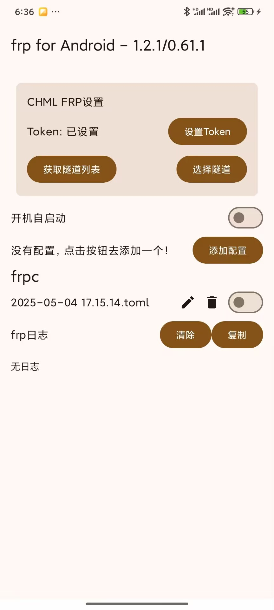

# CHML FRP Android
一个Android的frpc客户端，支持CHML FRP隧道配置  
A frp client for Android with CHML FRP tunnel support

>**遇到一切问题请在chmlfrp官方交流群交流，可以提issue，但更新随缘咯**

同时感谢AceDroidX大佬的开源精神和支持

原项目地址：https://github.com/AceDroidX/frp-Android

主要更改
- 更改为chmlfrp官方客户端
- 支持CHML FRP隧道快速命令配置
- 升级依赖版本
- 优化后台日志输出

简体中文 | [English](README_en.md)
>如果你想在Windows和Linux上也想快速获取配置文件并启动多个chmlfrp客户端可以尝试这个项目
> 
> https://github.com/2743305544/chmlfrp-cli
<div style="display:inline-block">

</div>

## 功能特点

- 支持标准frp配置文件
- 支持CHML FRP隧道配置
  - 从API获取隧道列表
  - 一键配置并启动隧道
  - 支持查看节点信息
- 支持开机自启动
- 支持后台运行

## 使用方法

### CHML FRP隧道配置

1. 在主界面点击"CHML FRP设置"卡片
2. 设置您的Token
3. 点击"获取隧道列表"按钮
4. 从列表中选择一个隧道
5. 点击"选择"按钮启动隧道

### 标准frp配置

## 编译方法

如果您想自定义frp内核，可以通过Github Actions或通过Android Studio编译

### 通过Github Actions编译

1. 将您的apk签名密钥文件转为base64，以下为Linux示例
```shell
base64 -w 0 keystore.jks > keystore.jks.base64
```
2. fork本项目
3. 转到Github项目的此页面：Settings > Secrets and variables > Actions > Repository secrets
4. 添加以下四个环境变量：
```KEY_ALIAS``` ```KEY_PASSWORD``` ```STORE_FILE``` ```STORE_PASSWORD```  
其中```STORE_FILE```的内容为步骤1的base64，其他环境变量内容请根据您的密钥文件自行填写
5. Push提交自动触发编译或在Actions页面手动触发

### 通过Android Studio编译

1. 在项目根目录创建apk签名密钥设置文件```keystore.properties```，内容参考同级的```keystore.example.properties```
2. 使用Android Studio进行编译打包

## 常见问题
### 项目的frp内核(libfrpc.so)是怎么来的？
直接从[frp的release](https://github.com/fatedier/frp/releases)里把对应ABI的Linux版本压缩包解压之后重命名frpc为libfrpc.so  
项目不是在代码里调用so中的方法，而是把so作为一个可执行文件，然后通过shell去执行对应的命令  
因为Golang的零依赖特性，所以可以直接在Android里通过shell运行可执行文件

### 开机自启与后台保活
按照原生Android规范设计，如有问题请在系统设置内允许开机自启/后台运行相关选项
